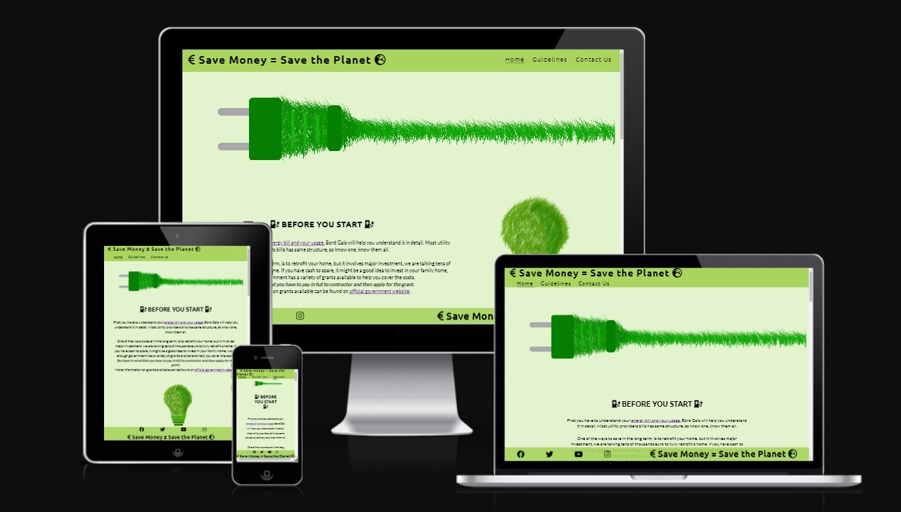

 
<h1>Energy Saving project</h1>

The Energy Saving project website is to help people understand their energy usage at home and help them reduce cost of living during these hard times

User of this website will find usefull information on how to improve their home and make it more energy efficient and save some money on energy bills.

 

<h2>Features</h2>

 

<ul><h3>Main page</h3>
<li>Before you start section - links to grants available for retrofitting home and understanding energy bills</li>
<li>Drought-Proofing section - Video on how to drought-proof windows and other info on the topic</li>
<li>Smart use of Appliances section - tips how to save on smarter use on every day home appliances</li>
<li>Temperature, timers and controls section - tips how to save money on energy bills with heating controls</li>
</ul>

 

<ul><h3>Guidelines</h3>

<li>General information on how electricity is measured</li>
<li>Info on how to calculate how much energy appliances use</li>
<li>Table with already calculated in euros how much particular appliance cost to run</li>
</ul>

 

<ul><h3>Contact us</h3>
<li>Info on what can do for user if they contact us</li>
<li>Contact us form with necessary info when contacting us</li>
</ul>

 

<h2>Testing</h2>

 

<ul>
<li>I have tested this website in following browsers: Chrome, Firefox, Edge.</li>
<li>Tested website for responsivness using 'dev tools' on different resolutions for mobile devices</li>
<li>I have tested website links make sure they work and open in different tab</li>
<li>Contact us form has been tested to make sure all fields work as intended and submit buttom works</li>
</ul>

 

<h2>Bugs</h2>

 

<ul><h3>Solved bugs</h3>
<li>When deployed to GitHub, images failed to load.</li>
<li>After going further into the issue found that i have used absolute file path for images like below sample </li>

<li>Removing the starting " / " has fixed the issue.</li>

 

<h2>Validator testing</h2>
<ul>
<li>HTML
<ul>
<li>Checking code with the official W3C validator results with no errors</li>
</ul>
<li>CSS
<ul>
<li>Checking code with the official W3C (Jigsaw) results with no errors</li>
</ul>
<li>Accessibility
<ul>
<li>Lighthouse dev tool confirmed that the colors and fonts chosen for the project are easy to read and accessible
</ul>
</ul>

 

 

<h2>Unfixed bugs</h2>

No unfixed bugs found

 

<h2>Deployment</h2>

<ul>
<li>This website has been deployed to GitHub pages. The steps to deploy are as follows:</li>
<ul>
<li>In GitHub repository, navigate to settings tab</li>
<li>Go to Pages tab in navigation menu</li>
<li>From Branch drop down menu select main and click save</li>
<li>Once saved page will be deployed in a few minutes with direct link provided</li>
</ul>

The deployed website can be found here - <a href="https://marcialas.github.io/energy-saving/">Energy saving project</a>

 

<h2>Credits</h2>

<h3>Content</h3>
<ul>
<li>Table contents and some paragraph content taken from Bonkers.ie</li>
</ul>

 

<h3>Media</h3>
<ul>
<li>Images found on website taken from Pexels</li>
</ul>